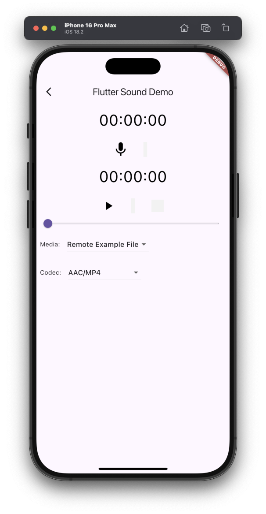

# Demo example

The example source [is there](https://github.com/canardoux/taudio/blob/master/example/lib/demo/demo.dart). You can have a live run of the examples [here](/live/index.html).

This is a demo of what it is possible to do with Flutter Sound. The code of this demo app is not so simple.

Flutter Sound beginners : you probably should look to [SimplePlayback](ex_simple_playback.html) and [SimpleRecorder](ex_simple_recorder.html)

The biggest interest of this Demo is that it shows most of the features of Flutter Sound :

* Plays from various media with various codecs
* Records to various media with various codecs
* Pause and Resume control from recording or playback
* Shows how to use a stream for getting the playback \(or recoding\) events
* Shows how to specify a callback function when a playback is terminated,
* Shows how to record to a Stream or playback from a stream
* ...

{