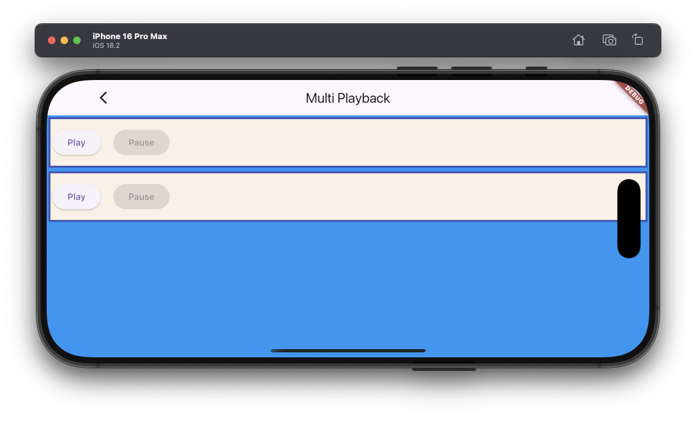

# Multi playbacks example

The example source [is there](https://github.com/canardoux/taudio/blob/master/example/lib/multi_playback/multi_playback.dart). You can have a live run of the examples [here](/live/index.html).

This is a simple example doing several playbacks at the same time.
It creates two [Player objects](/api/public_fs_flutter_sound_player/FlutterSoundPlayer-class.html) and use the verb [startPlayer()](/api/public_fs_flutter_sound_player/FlutterSoundPlayer/startPlayer.html) to play them.

This example shows also :
- The [Pause](/api/public_fs_flutter_sound_player/FlutterSoundPlayer/pausePlayer.html)/[Resume](/api/public_fs_flutter_sound_player/FlutterSoundPlayer/resumePlayer.html) feature.
- The Display of the elapsed time

