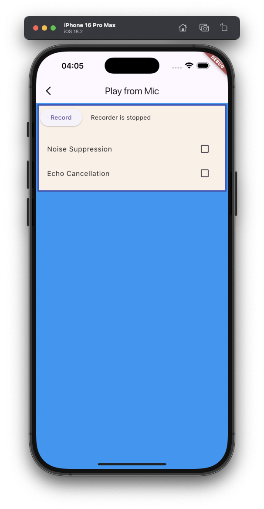

# Play from Mic example

The example source [is there](https://github.com/canardoux/flutter_sound/blob/master/example/lib/ex_play_from_mic/ex_play_from_mic.dart). You can have a live run of the examples [here](/live/index.html).

This is a very simple example, that shows how to loop from a recorder to a player.
It open a `Recorder to Stream` and plug the ouput of this recorder to a `Player from Stream`.

