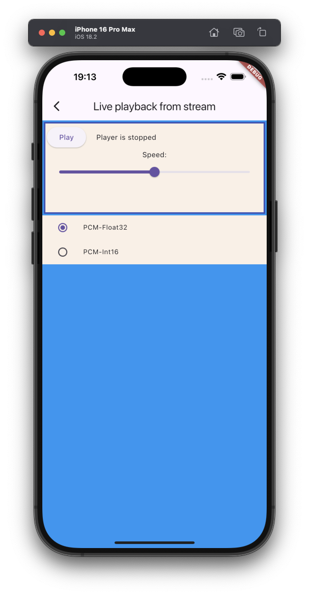

# Play Stream without flow control example

The example source [is there](https://github.com/canardoux/flutter_sound/blob/master/example/lib/livePlaybackWithoutBackPressure/live_playback_without_back_pressure.dart). You can have a live run of the examples [here](/live/index.html).

An example showing how to play Live Data without back pressure. It feeds a live stream, without waiting that the futures are completed for each block. This is simpler than playing buffers synchronously because the App does not need to await that the playback for each block is completed before playing another one.

This example get the data from an asset file, which is completely stupid : if an App wants to play an asset file he must use [startPlayer(fromDataBuffer:)](/api/public_flutter_sound_player/FlutterSoundPlayer/startPlayer.html).
Then it calls [startPlayerFromStream()](/api/public_flutter_sound_player/FlutterSoundPlayer/startPlayerFromStream.html) to play the buffer

Feeding Flutter Sound without back pressure is very simple but you can have two problems :

* If your App is too fast feeding the audio channel, it can have problems with the Stream memory used.
* The App does not have any knowledge of when the block given to Flutter Sound is really played.
For example, if it does a `stopPlayer()` it will loose all the buffered data not yet played.

## You can see also those examples:
- [Streams](ex_streams)
- [Record To Stream](ex_record_to_stream)
- [Live Playback With Backpressure](ex_playback_from_stream_2)

