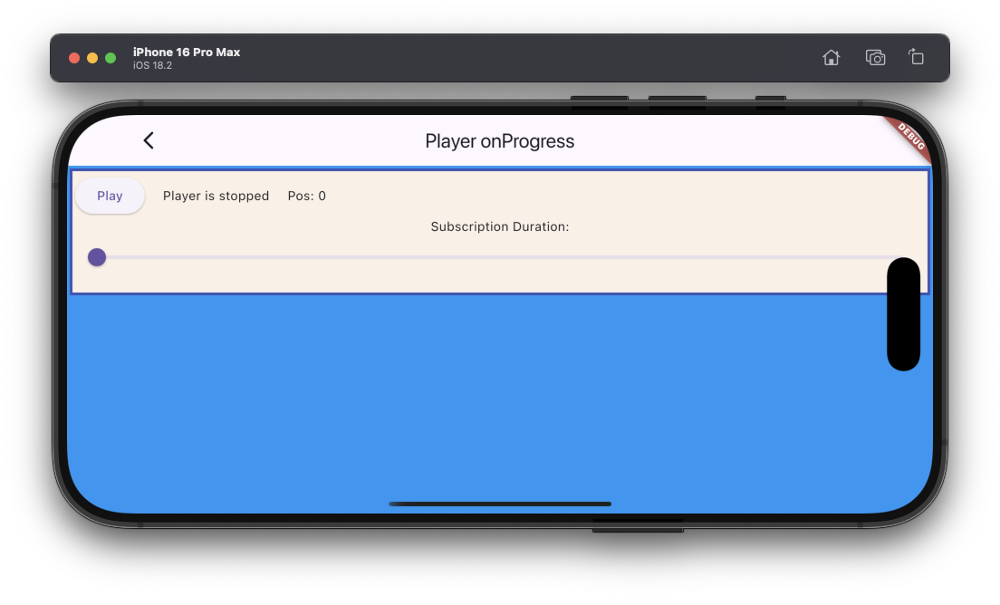

# Player onProgress example

The example source [is there](https://github.com/canardoux/taudio/blob/master/example/lib/player_onProgress/player_on_progress.dart). You can have a live run of the examples [here](/live/index.html).

This example shows how to use the verb [setSubscriptionDuration()](/api/public_fs_flutter_sound_player/FlutterSoundPlayer/setSubscriptionDuration.html) on a player for having an [onProgress](/api/public_fs_flutter_sound_player/FlutterSoundPlayer/onProgress.html) callback.
There is a slider to show how the playback frequency can be adjust.

This example is really basic.

