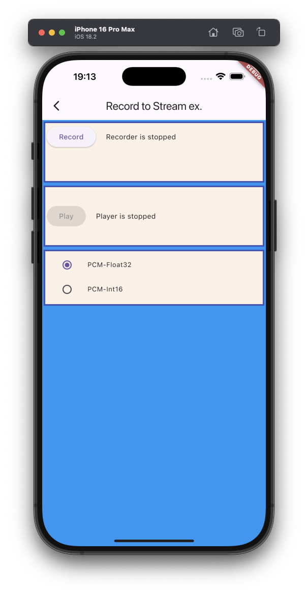

# Record to stream example

The example source [is there](https://github.com/canardoux/taudio/blob/master/example/lib/recordToStream/record_to_stream_example.dart). You can have a live run of the examples [here](/live/index.html).

This is an example showing how to record to a Dart Stream. It writes all the recorded data from a Stream to a File using It calls [startRecorder(toStream:)](/api/public_fs_flutter_sound_recorder/FlutterSoundRecorder/startRecorder.html) to fill a buffer from a stream, which is completely stupid: if an App wants to record something to a File, it must not use streams.
Then it can playback the file recorded.

The real interest of recording to a Stream is for example to feed a
Speech-to-Text engine, or for processing the Live data in Dart in real time.
 
 You can also refer to the following guide: 
 - [Dart Streams](/tau/guides/guides_live_streams.html):

