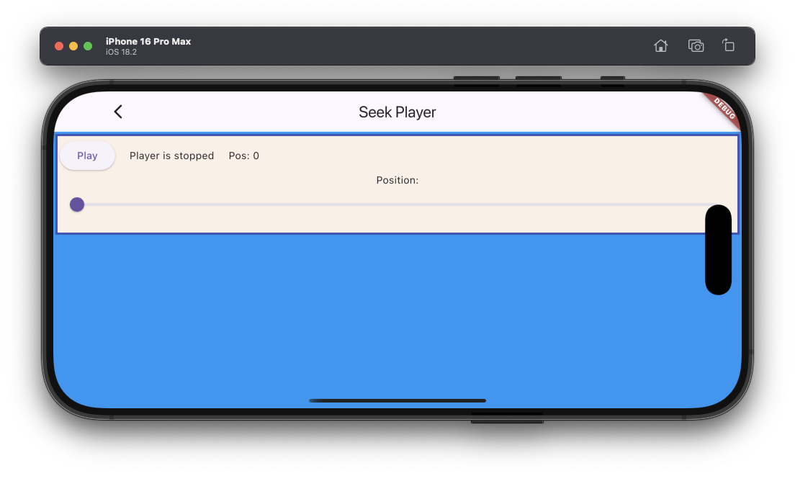

# Seek example

The example source [is there](https://github.com/canardoux/flutter_sound/blob/master/example/lib/seek/seek.dart). You can have a live run of the examples [here](/live/index.html).

This is a very simple basic example which allows the user to [set the position](/api/public_flutter_sound_player/FlutterSoundPlayer/seekToPlayer.html) into a playback.

This example is really basic.

