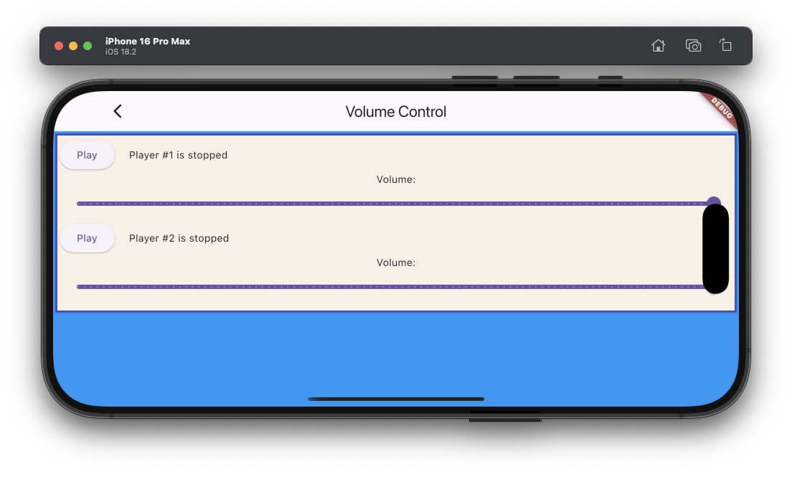

# Set volume example

The example source [is there](https://github.com/canardoux/taudio/blob/master/example/lib/volume_control/volume_control.dart). You can have a live run of the examples [here](/live/index.html).



This is a very simple basic example which allows the user to adjust the sound volume.
It launches two [Players](/api/public_fs_flutter_sound_player/FlutterSoundPlayer-class.html) which play each an asset. The User can [adjust the volume](/api/public_fs_flutter_sound_player/FlutterSoundPlayer/setVolume.html) of them independently.

This example is very basic.

