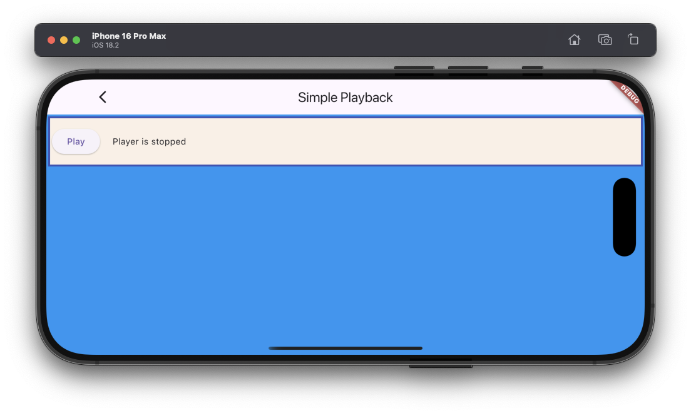

# Simple playback example

This is a very simple example for Flutter Sound beginners, that shows how to play a remote file.
It create a [Player object](/api/public_flutter_sound_player/FlutterSoundPlayer-class.html) and use the verb [startPlayer()](/api/public_flutter_sound_player/FlutterSoundPlayer/startPlayer.html).

This example is really basic.

