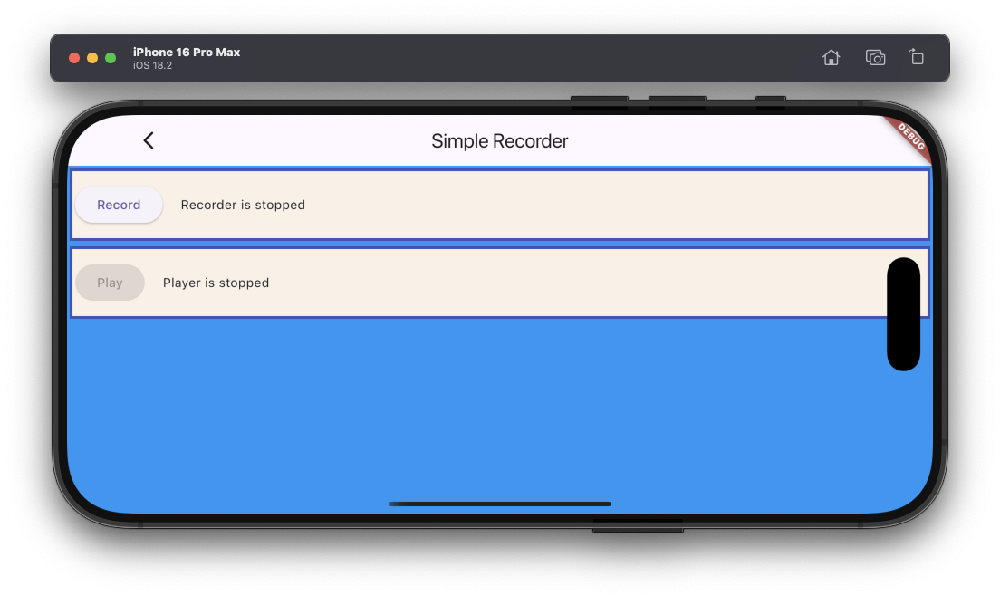

# Simple recorder example

The example source [is there](https://github.com/canardoux/taudio/blob/master/example/lib/simple_recorder/simple_recorder.dart). You can have a live run of the examples [here](/live/index.html).

This is a very simple example for Flutter Sound beginners, that shows how to record, and then playback a file. It create a [Recorder object](/api/public_fs_flutter_sound_recorder/FlutterSoundRecorder-class.html)
and use the verb [startRecorder()](/api/public_fs_flutter_sound_recorder/FlutterSoundRecorder/startRecorder.html).

This example is really basic.

