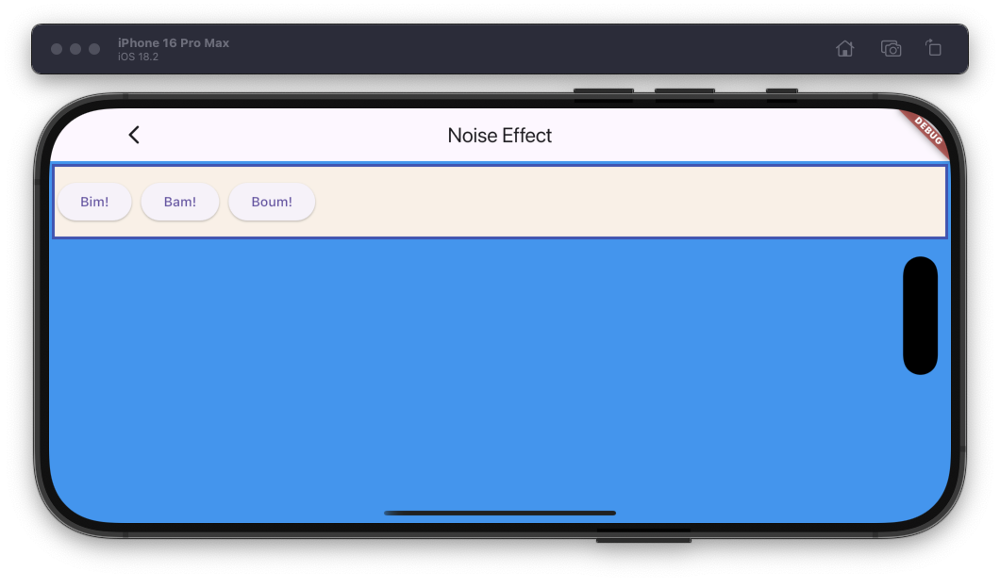

# Fast sound effect example

The example source [is there](https://github.com/canardoux/flutter_sound/blob/master/example/lib/soundEffect/sound_effect.dart). You can have a live run of the examples [here](/live/index.html).

Play from stream can be very efficient to play sound effects in real time. For example in a game App.

In this example, the App open three [players](/api/public_flutter_sound_player/FlutterSoundPlayer-class.html) and call [startPlayerFromStream()](/api/public_flutter_sound_player/FlutterSoundPlayer/startPlayerFromStream.html) during initialization.
When it want to play a noise, it has just to call the synchronous verb [feed](/api/public_flutter_sound_player/FlutterSoundPlayer/feedInt16FromStream.html). Very fast.

