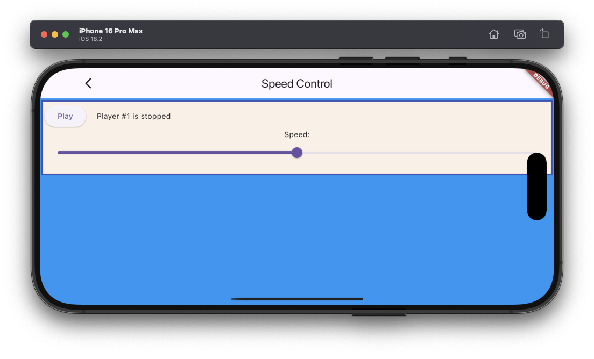

# Set speed example

The example source [is there](https://github.com/canardoux/flutter_sound/blob/master/example/lib/speed_control/speed_control.dart). You can have a live run of the examples [here](/live/index.html).

It launches a [Player](/api/public_flutter_sound_player/FlutterSoundPlayer-class.html) which play an asset. 
The User can [adjust the playback speed](/api/public_flutter_sound_player/FlutterSoundPlayer/setSpeed.html) of it.

This is a very simple example showing how tune the speed of a playback.

