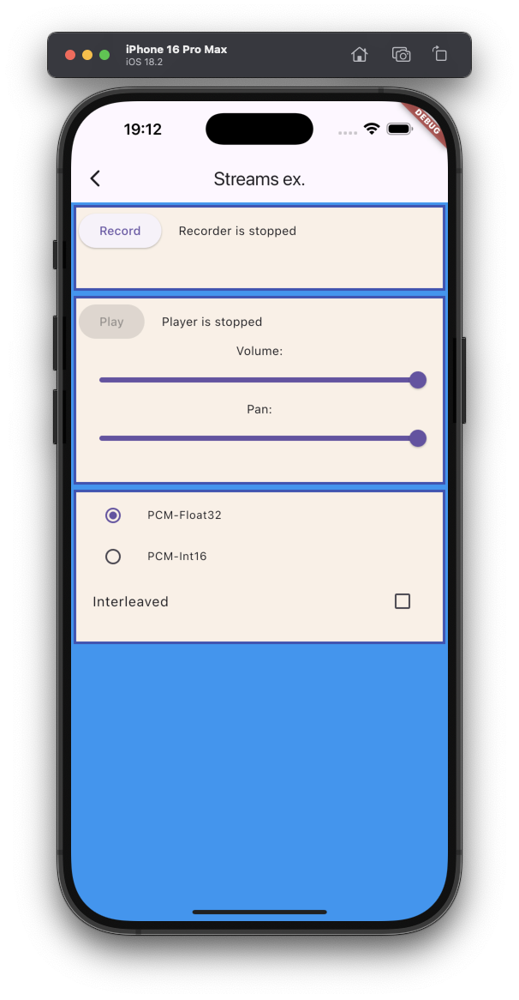

# Streams example

The example source [is there](https://github.com/canardoux/taudio/blob/master/example/lib/streams/streams.dart). You can have a live run of the examples [here](/live/index.html).

The real interest of recording to a Stream is for example to feed a Speech-to-Text engine, or for processing the Live data in Dart in real time.

This example can record something to a Stream. It handle the stream to stored the data in memory.
Then, the user can play a Stream that read the data store in memory.

The example create a [Player object](/api/public_fs_flutter_sound_player/FlutterSoundPlayer-class.html) and a [Recorder object](/api/public_fs_flutter_sound_recorder/FlutterSoundRecorder-class.html).
It calls [startRecorder(toStream:)](/api/public_fs_flutter_sound_recorder/FlutterSoundRecorder/startRecorder.html) to fill a buffer from a stream
and then it calls [startPlayerFromStream()](/api/public_fs_flutter_sound_player/FlutterSoundPlayer/startPlayerFromStream.html) to play the buffer from another stream.
The example is just a little bit complicated because there are inside both a player stream and a recorder stream,
because the user can select if he/she wants to use streams interleaved or planed, and because he/she can select to use
Float32 PCM or Int16 PCM

You can also refer to the following examples that uses UInt8List:

- [Record To Stream](ex_record_to_stream)
- [Live Playback Without Backpressure](ex_playback_from_stream_1)
- [Live Playback With Backpressure](ex_playback_from_stream_2)

This example shows also :
- The [Pause](/api/public_fs_flutter_sound_player/FlutterSoundPlayer/pausePlayer.html)/[Resume](/api/public_fs_flutter_sound_player/FlutterSoundPlayer/resumePlayer.html) feature.

